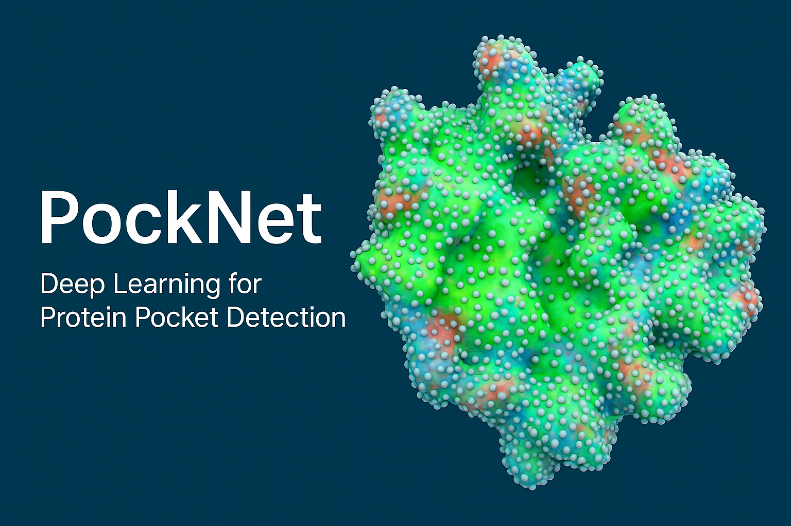

# PockNet Fusion Pipeline



This repository contains the current production pipeline used to train and
evaluate the **PockNet** fusion model.  
The active workflow combines per–surface-point tabular descriptors with ESM2
transformer embeddings and trains a Lightning module that learns attention over
structure-aware neighbour sets stored in an optimized H5 file.

The repository has been trimmed to focus on this transformer‑centric workflow.
Legacy experiments, notebooks, and random-forest/tabnet variants live under
`deprecated/` for reference.

---

## Highlights

- **Single source of truth for data** – feature CSVs and merged chain-fix tables live in `data/`.
- **Optimized H5 generation** – `generate_h5_v2_optimized.py` writes compact
  transformer-ready datasets with neighbour indices and distance metadata.
- **Toggleable k-NN aggregation** – `configs/data/h5_knn_enabled.yaml`
  configures on-the-fly k-NN aggregation; transformer mode is the default.
- **Hydra + Lightning** – experiments are reproducible and parameterised via
  `configs/`, with launch scripts that set up the environment automatically.

---

## Prerequisites

1. **Conda** (Miniconda or Anaconda) and CUDA 12.1 capable drivers.
2. **Git LFS** if you intend to version large binaries (optional).
3. An NVIDIA GPU for training/running the transformer model.

> **Important**  
> The training scripts expect the environment variable
> `PROJECT_ROOT` to point at the repository root.  
> You can set it once per session:
> ```bash
> export PROJECT_ROOT=$(pwd)
> ```

---

## Environment Setup

Create the main environment (named `pocknet_env`) and activate it:

```bash
conda env create -f environment.yaml
conda activate pocknet_env
```

The environment installs PyTorch 2.4 with CUDA 12.1 support, Lightning 2.5,
Hydra tooling, Biopython/DSSP for structural features, and the ESM2 model via
pip (`fair-esm`).

If you require a different CUDA toolkit version, adjust the `pytorch-cuda`
entry in `environment.yaml` accordingly or install PyTorch by following the
official instructions before running `pip install -r` for the remaining
packages.

---

## Repository Layout

```
├── README.md                     ← the document you’re reading
├── environment.yaml              ← conda environment (pocknet_env)
├── pyproject.toml / setup.py     ← packaging metadata
├── launch_aggressive_training.sh ← main Lightning launcher
├── launch_aggressive_swa.sh      ← SWA follow-up launcher
├── run_h5_generation_optimized.sh← optimized H5 builder entrypoint
├── configs/                      ← Hydra config tree (data/experiment/callbacks…)
├── src/                          ← datagen, datamodules, models, tools, train/eval
├── tests/                        ← current regression test for enhanced pipeline
├── post_processing/              ← legacy pipeline (under active refresh)
├── splits/                       ← curated protein ID lists (e.g., BU48)
├── CLEANUP_SUMMARY.md            ← change log for the cleanup pass
└── MODEL_CHANGELOG_OCT2025.md    ← high-level model change notes

(ignored locally but expected when running the pipeline)
├── data/                         ← generated features, embeddings, H5 files
├── logs/                         ← Lightning/Hydra run outputs
└── deprecated/                   ← archived notebooks & experiments
```

---

## Data Preparation Pipeline

1. **ESM2 embeddings** (per chain):  
   ```bash
   python src/tools/generate_esm2_embeddings.py \
       --ds-file data/all_train.ds \
       --pdb-base data/p2rank-datasets \
       --out-dir data/esm2_3B_chain
   ```
   You can pass multiple `--ds-file` arguments or restrict to specific protein
   lists (`--only-missing data/missing_esm_pdb_ids.txt`).

2. **Surface feature extraction** (optional unless you need to regenerate
   `data/output_train/`):  
   ```bash
   python src/datagen/extract_protein_features.py \
       data/all_train.ds data/output_train
   ```

3. **Chain fix merge** (generates the canonical CSV used by the H5 builder):  
   ```bash
   python src/datagen/merge_chainfix_complete.py
   ```
   The script reads `data/output_train/*.pdb_features.csv` and produces
   `data/vectorsTrain_all_chainfix.csv` (overwriting after creating a timestamped
   backup).

---

## H5 Generation

Run the optimized generator to write the transformer-ready dataset:

```bash
bash run_h5_generation_optimized.sh
```

The script validates inputs and writes
`data/h5/all_train_transformer_v2_optimized.h5`, including neighbour indices and
distance metadata for transformer aggregation. Logs appear in
`h5_generation_optimized.log`.

---

## Training

### Quick launch (recommended)

```bash
export PROJECT_ROOT=$(pwd)
bash launch_aggressive_training.sh
```

This starts DDP training across GPUs `1,3,4` in a tmux session named
`transformer_training`.  Logs stream to
`training_aggressive_<timestamp>.log` and metrics are pushed to W&B (project
`fusion_pocknet_thesis`) if you have credentials configured.

### SWA finetuning

To run the stochastic weight averaging schedule after base training finishes,
launch:

```bash
export PROJECT_ROOT=$(pwd)
bash launch_aggressive_swa.sh
```

### Running manually

You can also invoke Hydra directly:

```bash
export PROJECT_ROOT=$(pwd)
python src/train.py experiment=fusion_transformer_aggressive trainer.devices=2
```

The second maintained experiment, `fusion_all_train_complete`, uses mean pooled
ESM embeddings with optional on-the-fly k-NN aggregation and can be selected in
the same manner.

---

## Evaluation

Hydra uses the new transformer defaults, so evaluation is straightforward:

```bash
export PROJECT_ROOT=$(pwd)
python src/eval.py \
    experiment=fusion_transformer_aggressive \
    ckpt_path=/path/to/checkpoint.ckpt
```

CSV logs for evaluation runs are emitted under `logs/<task>/runs/...` alongside
Hydra configuration snapshots.

---

## Post-processing

The enhanced post-processing and production pipelines are currently being
refreshed.  The existing implementation remains under `post_processing/` and is
covered by `tests/test_enhanced_pipeline_config.py`, but it is not part of the
active training workflow yet.

---

## Troubleshooting

- **Hydra override errors:** override syntax is strict.  Refer to
  <https://hydra.cc/docs/advanced/override_grammar/basic> if you see
  `mismatched input '=' expecting <EOF>`.
- **Missing H5 or embeddings:** ensure `data/esm2_3B_chain/`,
  `data/output_train/`, and `data/vectorsTrain_all_chainfix.csv` exist before
  running the H5 generator.
- **Shared memory errors:** the datamodule writes to `/dev/shm/pocknet` by
  default.  If `/dev/shm` is unavailable, set `POCKNET_SHM_DIR` to a writable
  tmpfs path before launching training.
- **W&B offline:** set `WANDB_MODE=offline` or edit `configs/logger/wandb.yaml`
  if you prefer not to push metrics.

---

## Contributing / Roadmap

1. Flesh out the refreshed post-processing pipeline (with deterministic tests).
2. Automate end-to-end retraining via a single CLI entrypoint.
3. Rename the model and configs to the final PockNet naming once training wraps.

Pull requests are welcome—please place experimental work under `deprecated/` or
open an issue if you plan a larger refactor.

---

© 2025 PockNet Project – maintained for the fusion transformer pipeline.
