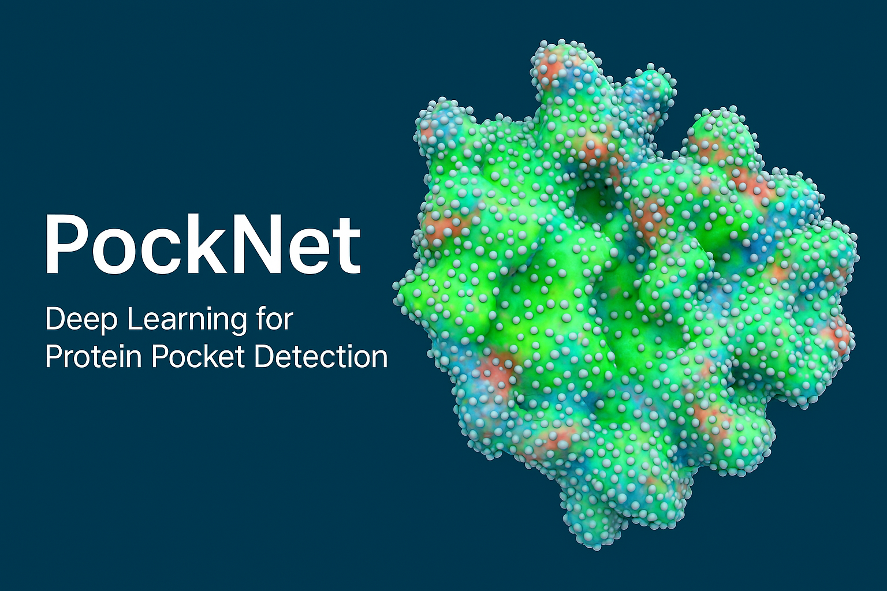

# PockNet - Protein Binding Site Prediction



**PockNet** is a research and engineering pipeline for ligand binding-site prediction on protein structures. It combines handcrafted physicochemical surface descriptors, ESM2 protein language model embeddings, and neighbourhood-aware transformer aggregation to predict ligandable surface regions relevant for structure-based drug discovery.

This project was developed as part of my Master's thesis in Artificial Intelligence at Johannes Kepler University Linz, supervised by Günter Klambauer and Florian Sestak.

> Thesis title: **Progressive Feature Enrichment for Ligand Binding-Site Prediction: From Tabular Chemistry to Protein Language Models**

Model artifacts: `https://huggingface.co/lal3lu03/PockNet`

---

## Why this matters

An early step in structure-based drug discovery is identifying where small molecules can bind on a protein surface. These binding pockets can guide docking, virtual screening, hit discovery, and downstream molecular design.

PockNet studies this task as a supervised surface-point prediction problem:

* **Input**: protein structure
* **Representation**: solvent-accessible surface points with structural, chemical, and sequence-derived features
* **Output**: ligandability scores and clustered pocket predictions

The project focuses on one central question:

> How much do local physicochemical descriptors, protein language model embeddings, and spatial neighbourhood context each contribute to binding-site prediction?

---

## Project summary

PockNet is built around a staged feature enrichment design.

| Stage     | Model              | Input features                                           | Purpose                                               |
| --------- | ------------------ | -------------------------------------------------------- | ----------------------------------------------------- |
| Stage I   | Tabular baseline   | 35 P2Rank-style physicochemical descriptors              | Reproduce and modernize a strong handcrafted baseline |
| Stage II  | Tabular + ESM2     | Physicochemical descriptors + centred residue embeddings | Add sequence-derived protein language model context   |
| Stage III | Transformer fusion | Surface descriptors + ESM2 + kNN neighbourhood attention | Model spatially coherent pocket regions               |

The final fusion model predicts ligandable solvent-accessible surface points and converts high-scoring regions into ranked pocket predictions using DBSCAN-style clustering and P2Rank-inspired post-processing.

---

## Key features

* **Biomedical AI application**: protein binding-site prediction for structure-based drug discovery
* **Protein language models**: ESM2 embeddings for residue-level biological context
* **Surface-based learning**: solvent-accessible surface point representation
* **Transformer fusion**: kNN-restricted neighbourhood attention over local protein surface regions
* **Reproducible ML pipeline**: Hydra configs, PyTorch Lightning, deterministic seeds, and logged experiment outputs
* **Scalable training**: DDP-compatible training for multi-GPU environments
* **Containerized inference**: Docker image with CLI-based prediction workflows
* **Post-processing**: pocket clustering, scoring, DCC/DCA success metrics, and PyMOL-ready outputs

---

## Architecture overview

PockNet combines three complementary information sources:

1. **Local physicochemical descriptors**
   P2Rank-style 35-dimensional descriptors encode local surface geometry, exposure, hydrophobicity, charge-related patterns, and donor/acceptor statistics.

2. **Protein language model embeddings**
   ESM2 residue embeddings provide sequence-derived context learned from large protein sequence corpora.

3. **Neighbourhood-aware transformer aggregation**
   For each solvent-accessible surface point, PockNet gathers nearby surface neighbours using kNN and applies transformer-style attention with distance-aware context aggregation.

The final model predicts a ligandability score for each surface point. High-scoring points are clustered into candidate binding pockets.

```text
Protein structure
      |
      v
Solvent-accessible surface generation
      |
      v
Physicochemical descriptors + ESM2 residue embeddings
      |
      v
kNN neighbourhood construction
      |
      v
Transformer fusion model
      |
      v
Point-wise ligandability scores
      |
      v
DBSCAN pocket clustering and ranking
      |
      v
Predicted binding pockets
```

---

## Results

Evaluation is performed on **BU48**, a challenging apo/holo benchmark of 48 protein pairs. The model is trained and validated on CHEN11 plus the joint P2Rank dataset split and tested on BU48.

### SAS-point performance

| Stage | Model variant           | BU48 IoUSAS | BU48 AUPRC | Notes                           |
| ----- | ----------------------- | ----------: | ---------: | ------------------------------- |
| I     | Tabular baseline        |      0.1498 |      0.231 | 35 handcrafted descriptors      |
| II    | Tabular + ESM2          |      0.2488 |      0.362 | Adds centred residue embeddings |
| III   | Transformer + kNN       |       0.309 |      0.437 | Best raw Stage III checkpoint   |
| III   | Transformer + kNN + SWA |       0.305 |      0.446 | SWA improves AUPRC              |

### Pocket-level performance

After DBSCAN-based post-processing and pocket ranking:

| Metric                             |          Result |
| ---------------------------------- | --------------: |
| Mean IoUpocket, five-seed ensemble | 0.128 +/- 0.012 |
| Best per-protein IoUpocket         | 0.158 +/- 0.014 |
| Ground-truth coverage              | 0.898 +/- 0.006 |
| DCC success@1                      |             39% |
| DCA success@1                      |             75% |
| DCC success@3                      |             50% |
| DCA success@3                      |             89% |

These results show that geometric descriptors, protein language model embeddings, and local neighbourhood aggregation provide complementary signals for binding-site prediction.

---

## Example use case

Given a protein structure file, PockNet can generate predicted ligandable pockets:

```bash
docker run --rm --gpus all \
  -v $PWD/data:/workspace/data \
  -v $PWD/logs:/workspace/logs \
  -v $PWD/tmp:/workspace/PockNet/tmp \
  -v $PWD/esm_cache:/workspace/.cache/torch \
  ghcr.io/lal3lu03/pocknet:1.0.0 \
  predict-pdb /workspace/data/example/1a4j.pdb \
    --output /workspace/logs/single_protein \
    --prep-device cuda:0
```

Expected outputs include:

```text
logs/single_protein/
├── pockets.csv
├── point_predictions.csv
├── prediction_summary.json
├── pymol_visualization.pml
└── intermediate files
```

---

## Installation

### Conda setup

```bash
git clone https://github.com/lal3lu03/PockNet.git
cd PockNet

conda env create -f environment.yaml
conda activate pocknet_env

export PROJECT_ROOT=$(pwd)
```

The environment includes:

* Python
* PyTorch
* PyTorch Lightning
* Hydra
* Biopython
* DSSP-related tooling
* ESM2 dependencies through `fair-esm`
* HDF5 and scientific Python libraries

A CUDA-capable GPU is recommended for training and large-scale inference.

---

## Docker setup

Build the image locally:

```bash
docker build -t pocknet:cuda12.4 .
```

Or pull the published image:

```bash
docker pull ghcr.io/lal3lu03/pocknet:1.0.0
```

Check the CLI:

```bash
docker run --rm ghcr.io/lal3lu03/pocknet:1.0.0 --help
```

The Docker image contains the PockNet codebase and default checkpoint. ESM2 model weights are downloaded on first use and should be cached through a mounted volume.

Recommended volume mounts:

| Volume                              | Purpose                                           |
| ----------------------------------- | ------------------------------------------------- |
| `data:/workspace/data`              | Input structures and datasets                     |
| `logs:/workspace/logs`              | Prediction outputs and metrics                    |
| `tmp:/workspace/PockNet/tmp`        | Intermediate feature, embedding, and H5 artifacts |
| `esm_cache:/workspace/.cache/torch` | Persistent ESM2 model cache                       |

---

## Command line interface

PockNet exposes a Click-based CLI through:

```bash
python src/scripts/end_to_end_pipeline.py --help
```

### Main commands

| Command           | Purpose                                                  |
| ----------------- | -------------------------------------------------------- |
| `predict-pdb`     | Run inference on a single PDB file or protein ID         |
| `predict-dataset` | Run inference on an existing H5 dataset                  |
| `auto-run`        | Generate features, embeddings, H5 files, and predictions |
| `train-model`     | Launch Hydra/PyTorch Lightning training                  |
| `full-run`        | Run a combined train and inference workflow              |

---

## Single-protein inference

### Docker

```bash
docker run --rm --gpus all \
  -v $PWD/data:/workspace/data \
  -v $PWD/logs:/workspace/logs \
  -v $PWD/tmp:/workspace/PockNet/tmp \
  -v $PWD/esm_cache:/workspace/.cache/torch \
  ghcr.io/lal3lu03/pocknet:1.0.0 \
  predict-pdb /workspace/data/example/1a4j.pdb \
    --output /workspace/logs/single_protein \
    --prep-device cuda:0
```

### Local environment

```bash
export PROJECT_ROOT=$(pwd)

python src/scripts/end_to_end_pipeline.py predict-pdb data/example/1a4j.pdb \
  --output outputs/single_protein \
  --prep-device cuda:0
```

For CPU-only inference:

```bash
python src/scripts/end_to_end_pipeline.py predict-pdb data/example/1a4j.pdb \
  --output outputs/single_protein_cpu \
  --prep-device cpu
```

CPU mode is functional but significantly slower, especially during ESM2 embedding generation.

---

## Dataset inference

Run inference on a prepared H5 dataset:

```bash
python src/scripts/end_to_end_pipeline.py predict-dataset \
  --h5 data/h5/all_train_transformer_v2_optimized.h5 \
  --csv data/vectorsTrain_all_chainfix.csv \
  --output outputs/pocknet_eval
```

Docker version:

```bash
docker run --rm --gpus all \
  -v $PWD/data:/workspace/data \
  -v $PWD/logs:/workspace/logs \
  ghcr.io/lal3lu03/pocknet:1.0.0 \
  predict-dataset \
    --h5 /workspace/data/h5/all_train_transformer_v2_optimized.h5 \
    --csv /workspace/data/vectorsTrain_all_chainfix.csv \
    --output /workspace/logs/dataset_run
```

---

## Data preparation

The full training pipeline uses:

* **Training and validation**: CHEN11 plus the complete joint P2Rank dataset
* **Testing**: BU48, held out for final evaluation

### 1. Generate ESM2 embeddings

```bash
python src/tools/generate_esm2_embeddings.py \
  --ds-file data/all_train.ds \
  --pdb-base data/p2rank-datasets \
  --out-dir data/esm2_3B_chain
```

### 2. Extract surface features

```bash
python src/datagen/extract_protein_features.py \
  data/all_train.ds data/output_train
```

### 3. Merge chain-fixed feature tables

```bash
python src/datagen/merge_chainfix_complete.py
```

This creates the canonical feature CSV:

```text
data/vectorsTrain_all_chainfix.csv
```

### 4. Build optimized H5 dataset

```bash
bash run_h5_generation_optimized.sh
```

The optimized H5 file stores features, neighbour indices, and distance metadata:

```text
data/h5/all_train_transformer_v2_optimized.h5
```

---

## Training

### Recommended CLI workflow

```bash
python src/scripts/end_to_end_pipeline.py train-model \
  --summary outputs/train_summary.json \
  -o experiment=fusion_transformer_aggressive \
  -o trainer.devices=2
```

### Hydra workflow

```bash
export PROJECT_ROOT=$(pwd)

python src/train.py \
  experiment=fusion_transformer_aggressive \
  trainer.devices=2
```

### Legacy launcher

```bash
export PROJECT_ROOT=$(pwd)
bash launch_aggressive_training.sh
```

### SWA finetuning

```bash
export PROJECT_ROOT=$(pwd)
bash launch_aggressive_swa.sh
```

Training supports:

* PyTorch Lightning
* Hydra configuration management
* Distributed Data Parallel training
* W&B logging
* Checkpointing
* Seed-controlled experiments
* SWA finetuning

---

## Evaluation

Evaluate a checkpoint:

```bash
export PROJECT_ROOT=$(pwd)

python src/eval.py \
  experiment=fusion_transformer_aggressive \
  ckpt_path=/path/to/checkpoint.ckpt
```

Evaluation outputs include:

* point-level metrics
* pocket-level metrics
* clustered pocket predictions
* per-protein summaries
* Hydra config snapshots
* CSV logs
* optional PyMOL visualization files

---

## Post-processing

PockNet converts point-wise ligandability scores into pocket predictions through:

1. thresholding high-scoring SAS points
2. DBSCAN clustering
3. pocket scoring
4. non-maximum suppression
5. DCC and DCA distance-based evaluation

Main implementation:

```text
post_processing/pocketnet_aggregation.py
```

Production entry point:

```text
post_processing/run_production_pipeline.py
```

The post-processing stage follows P2Rank-style conventions for pocket-level evaluation and ranking.

---

## Repository layout

```text
PockNet/
├── README.md
├── environment.yaml
├── pyproject.toml
├── setup.py
├── Dockerfile
├── Makefile
├── configs/
│   ├── data/
│   ├── experiment/
│   ├── model/
│   ├── trainer/
│   └── logger/
├── src/
│   ├── datagen/
│   ├── datamodules/
│   ├── models/
│   ├── scripts/
│   ├── tools/
│   ├── train.py
│   └── eval.py
├── post_processing/
├── splits/
├── seeds/
├── docs/
├── data/
├── logs/
├── outputs/
├── deprecated/
├── REPRODUCIBILITY.md
└── LICENSE
```

Large generated artifacts such as datasets, embeddings, H5 files, checkpoints, logs, and temporary outputs are not expected to be committed directly.

---

## Reproducibility

The project is designed for reproducible research workflows:

* deterministic seed configuration in `seeds/master_seeds.yaml`
* Hydra config snapshots for each run
* checkpointed PyTorch Lightning training
* Dockerized release environment
* documented dataset manifests
* SHA-256 digest tracking in `REPRODUCIBILITY.md`
* logged evaluation outputs and post-processing summaries

Main reproducibility files:

```text
REPRODUCIBILITY.md
seeds/master_seeds.yaml
docs/src_variable_renames.csv
docs/REFERENCES_P2RANK.md
```

---

## Makefile shortcuts

```bash
make docker-build
make docker-run ARGS="--help"
make docker-run ARGS="predict-pdb /workspace/data/example/1a4j.pdb --output /workspace/logs/test"
make docker-full-run
```

---

## Troubleshooting

### Hydra override errors

Hydra override syntax is strict. Use:

```bash
-o trainer.devices=2
```

or:

```bash
python src/train.py trainer.devices=2
```

Avoid spaces around `=`.

### Missing embeddings or H5 files

Check that the following exist:

```text
data/esm2_3B_chain/
data/output_train/
data/vectorsTrain_all_chainfix.csv
data/h5/all_train_transformer_v2_optimized.h5
```

### ESM2 downloads repeatedly

Mount a persistent cache:

```bash
-v $PWD/esm_cache:/workspace/.cache/torch
```

### Shared memory issues

Set a custom shared-memory directory:

```bash
export POCKNET_SHM_DIR=/path/to/writable/tmpfs
```

### W&B offline mode

```bash
export WANDB_MODE=offline
```

---

## Limitations

PockNet is a research project and should not be interpreted as an experimentally validated drug-discovery tool.

Current limitations include:

* predictions are computational and not prospectively validated
* BU48 contains only 48 apo/holo protein pairs
* membrane proteins, intrinsically disordered proteins, and non-canonical ligands are underrepresented
* ESM2 embeddings are frozen in the reported experiments
* the final neighbourhood size is fixed to k = 3
* pocket-level performance is stricter than SAS-point performance because predictions must form coherent spatial objects

---

## Roadmap

Planned or natural next steps:

* integrate equivariant graph neural networks for geometry-aware message passing
* expand evaluation to COACH420, HOLO4K, and PDBbind
* test AlphaFold-predicted structures with docked ligands
* add multi-task prediction for ligandability and interaction types
* explore task-adaptive protein language model fine-tuning
* improve calibration and uncertainty estimation
* package the inference pipeline as a cleaner Python API

---

## Citation and provenance

This project builds on ideas from P2Rank-style surface-point learning and uses a recreated solvent-accessible surface descriptor pipeline.

Please cite the original P2Rank work when reusing the descriptor or post-processing concepts:

```text
Krivák, R., & Hoksza, D. (2018).
P2Rank: machine learning based tool for rapid and accurate prediction of ligand binding sites from protein structure.
Journal of Cheminformatics, 10(1), 39.
```

---

## Acknowledgements

This project was supervised by:

* Univ. Prof. Mag. Dr. Günter Klambauer
* Florian Sestak, MSc

Developed at Johannes Kepler University Linz, Institute for Machine Learning.

---

## License

Apache License 2.0. See `LICENSE` for details.

---

## Maintainer

Maximilian Hageneder
LinkedIn: `https://www.linkedin.com/in/maximilian-hageneder-ai`
